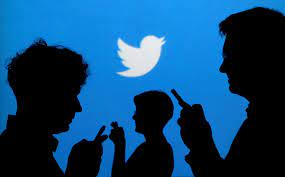
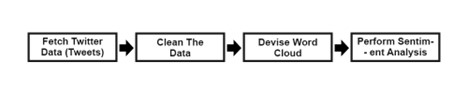
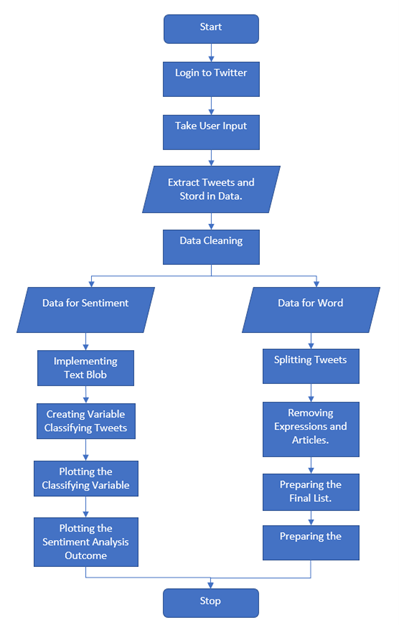
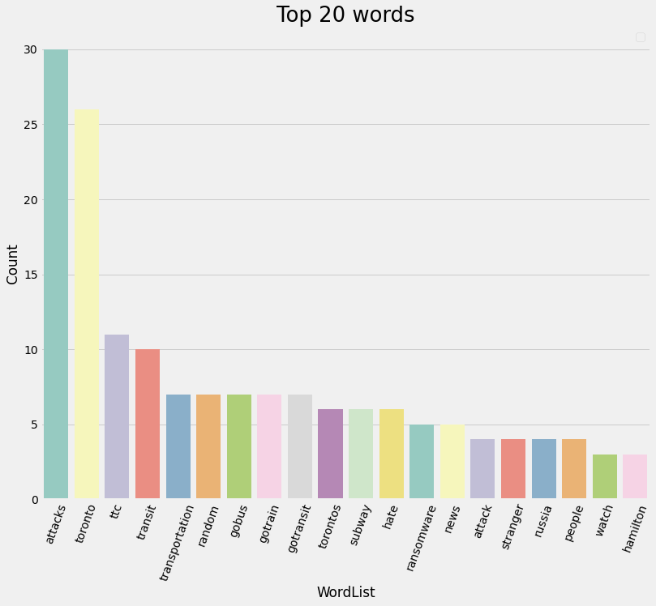
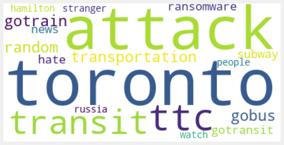
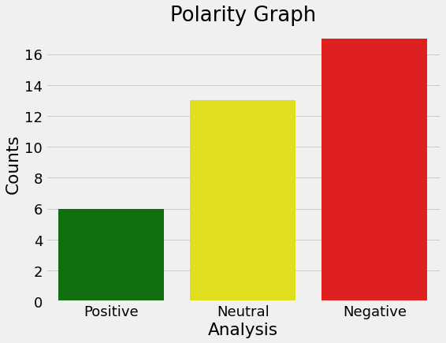
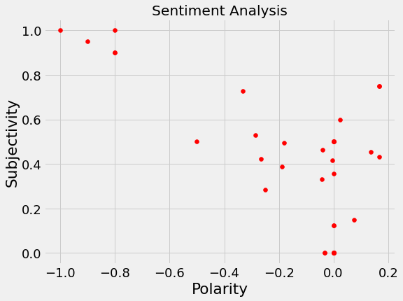

# Twitter-Sentiment-Analysis

<a href="https://twitter.com/">Twitter</a> is one of the biggest social media platforms out there with approximately 300 million registered users worldwide.
On average, over 6000 tweets are sent out every single second which corresponds to over 350,000 tweets per minute.
 These tweets come from a variety of sources and can vary when it comes to the subject and context. 
 However, each tweet shares a common trait – an opinion that is no longer than 280 characters. 
 Each trend is represented by a hashtag, and each hashtag includes a stream of reiterating tweets.
 
The goal of sentiment analysis project is to fetch tweets belonging to the hashtag chosen by the user and determine the number of people that are in favor or against the subject in question. 
This knowledge can further be applied to improve a business’s functioning, and/or predict trends and products that users may be interested in. 
The information gained can also be applied to launch campaigns tailored to a targeted audience.

## Abstract
In this project, I am using Python to source tweets from Twitter using a Twitter Developer Account on discussions that are trending on the platform or based on user input.
I will also be <b>cleaning</b> and <b>processing</b> the data to analyze the buzzing keywords from related topics.
I'll see the top 20 words that are most trending to the related search to gauge the main word and then running a sentiment analysis to understand the public view on the topic.

## Sentiment Analysis Topic for this Project
I am in Toronto, and everyday I hear some or the other life threatning attack happening in somepart of the city.
So, I am thought to see how people of toronto are reacting to this issue, and what are the most used words.
This might give us an Insight to what's actually happening in the City.
Our search keyword is going to be - <b><i>"Toronto Attacks"</i></b>

## Project Infrastructure and Technology Used
	To complete the project we have leveraged following resources:
•	Python  
•	Natural Language Processing (NLP)  
•	TextBlob  
•	WordCloud  
•	TweePy  
•	Twitter API  
•	Jupyter Notebook  

## Method / Project Roadmap 

•	Fetch Twitter Data : Fetch tweets from Twitter and store them in a data frame.  
•	Clean The Data : Remove redundant and unnecessary data from tweets so that it can be easily operated on.  
•	Devise Word Cloud : Use TextBlob to devise a word cloud to determine the top 20 trends of the given topic.  
•	Perform Sentiment Analysis : Determine whether the take of the masses is Positive, Neutral, or Negative.  

Figure: Flow Chart

## My Findings - 
After cleaning and analysing the top 20 words for the search "Toronto Attacks".

1.Top 20 most occuring word for the search are 

 

2. Also, I prepared a Wordcloud for these words to have a fair view of the bar chart

Figure: WordCloud

• These words mostly signify that attacks are being done mostly at public places.  
• Words like TTC, Transit, GoBus,Gotransit,Subway,etc strongly signify that these incidents happen while commuting.  
• The word <b>"Random"</b> is in top 6 words, which tells us that these attacks are done randomly and there is lesser chance of any motive behind these attacks.  
• I also noticed 'hate' being one in top 10 words, this signifies hate being spread for the attacks done, or it can cause a community hatred among the masses  

3. For the Sentiment analysis I've prepared a bar graph and scatter plot

Figure: Bar Graph
 
In the Polarity Graph, It can clearly be seen that count fr the negative is even more than double that of the positive.

Figure: Scatter Plot
 
In the above scatterplot, we can see the scatterplot is more towards the left, which signifies the negative sentiments related to the 'Toronto Attacks' which is very obvious too.

## Conclusion 
Sentiments of the masses on Toronto Attacks, People mostly have Negative sentiments related to the incidents happening.
This has also created unsafe mindset for commuters to travel in the Public Transport.
